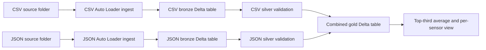

# Sensor Data Pipeline

## Purpose and Scope

Task : 
1.Ingest two source folders
2.combine the datasets
3.handle data-quality errors
4.present the average of the top one-third of sensor values. 
5.The extended requirement asks that the solution scale to a much larger dataset, potentially over 500 GB, when compute is scaled up.

## Technology Stack and Features

| Technology | Role |
| --- | --- |
| Databricks Jobs | Orchestrates the CSV, JSON, silver, and gold tasks with dependencies. |
| Python and PySpark | Implements Auto Loader ingestion and Spark DataFrame writes. |
| Spark SQL | Creates Delta tables, parses and validates sensor values, and computes the ranking and averages. |
| Auto Loader (`cloudFiles`) | Incrementally discovers CSV and JSON files and tracks progress with checkpoints. |
| Delta Lake | Stores bronze, silver, corrupted, and gold data with transactional table writes. |
| Unity Catalog Volumes | Supplies landing data and stores Auto Loader schemas and checkpoints. |

Implemented features include two-source ingestion, incremental file discovery, schema rescue, silver-layer type and date validation, a corrupted-row destination, a combined gold table, an overall top-third average, and a per-sensor top-third average view.

## Architecture

CSV and JSON ingestion run independently. Each silver task waits for its matching ingest task. Gold waits for both silver tasks, so it only combines the inputs after both branches complete successfully.

## Components

| Component | File | Responsibility |
| --- | --- | --- |
| Job orchestration | `pl_sensor_data.yml` | Defines the task graph, notebook paths, shared parameters, and job queue. |
| Bronze ingestion | `ingest_files.py` | Uses Auto Loader to discover source files, adds ingest metadata, and appends rows to Delta. |
| Silver processing | `clean_data.py` | Converts sensor fields to expected types and routes invalid rows to a corrupted-data table. |
| Gold processing | `gold_data.py` | Combines both silver tables and calculates top-third averages. |

## Job Configuration

The job resource is named `pl_sensor_data`. The four task keys are `csv_ingest`, `csv_silver`, `json_ingest`, and `json_silver`, followed by `gold_layer`.

The job-level key/value parameters are:

| Parameter | Default | Use |
| --- | --- | --- |
| `env` | `prod` | Selects the environment-specific schemas, volumes, and paths. |
| `schema_path` | `/Volumes/robocrit/robocrit_bronze_{env}/schemapaths` | Auto Loader schema tracking root. |
| `checkpoint_path` | `/Volumes/robocrit/robocrit_bronze_{env}/checkpoints` | Streaming checkpoint root. |
| `clear_data` | `"0"` | When set to `"1"`, silver and gold scripts drop their output tables before recreating them. |

Databricks pushes job-level key/value parameters to compatible task parameters. The ingest tasks additionally receive `file_type` and `file_path`; silver tasks receive the bronze table name.

The YAML does not define a schedule or file-arrival trigger, so scheduling must be configured separately if the job should run automatically. Notebook paths currently refer to a specific user's workspace directory, which makes deployment to other users or workspaces less portable. Compute availability and serverless compatibility must also be verified in the target workspace.

## Data Flow

### 1. Bronze Ingestion

`ingest_files.py` is run once for CSV and once for JSON. It reads the job parameters, creates the bronze schema and Unity Catalog volumes, then starts an Auto Loader stream using the configured source path.

The stream uses:

- `cloudFiles.format` set to the task's `file_type`.
- A schema location specific to the source table.
- Rescue mode with `_rescued_data` to retain data that does not fit the inferred schema.
- A maximum of 1,000 files and a soft target of 50 GB per micro-batch.
- `availableNow=True`, which processes the files available at stream start across micro-batches, then stops. Files arriving after startup are picked up on a later run.

For each micro-batch, the `foreachBatch` function adds:

| Column | Current derivation |
| --- | --- |
| `yyyymmdd` | Parent directory name extracted from `_metadata.file_path`. This is the source-folder date, not necessarily the event date. |
| `load_date` | Current processing timestamp. |
| `batch_id` | `epoch_id + 1` for the Auto Loader query. |

Rows are appended to `robocrit.robocrit_bronze_{env}.csv_sensor_data` or `json_sensor_data`, partitioned by `yyyymmdd` and `batch_id`. Delta transaction identifiers use the target table as `txnAppId` and the streaming `epoch_id` as `txnVersion`, so a retried micro-batch can be recognized as already committed.

The checkpoint is source-specific (`{checkpoint_path}/{target_table}`) and is required to track discovered files and streaming progress. Keep it durable and do not delete it as routine cleanup. If a checkpoint is deliberately reset, the Delta transaction app ID/version sequence must also be handled deliberately; a restarted epoch sequence can otherwise be mistaken for previously committed transactions.

### 2. Silver Validation

`clean_data.py` runs once per bronze table. It creates the silver schema and two Delta tables:

- `robocrit.robocrit_silver_{env}.{table}` for valid rows.
- `robocrit.robocrit_silver_{env}.{table}_corrupted` for rows that fail validation.

The valid table converts `event_date` using several timestamp formats, casts `sensor_number` to integer, and casts `sensor_value` to `DECIMAL(20,16)`. It excludes records with invalid converted fields, a non-null `_rescued_data`, or an invalid source-folder date.

Rows with failed field conversions, rescued data, or an invalid source-folder date are inserted into the corrupted table. The table retains the original sensor fields and metadata, the `_rescued_data` payload, and a semicolon-separated `corruption_reason` value. Reason codes include `invalid_event_date`, `invalid_sensor_number`, `invalid_sensor_value`, `schema_rescue`, and `invalid_source_folder_date`; a row can have more than one reason. The script adds the two quarantine columns to an existing table when they are missing, preserving prior quarantined rows; those older rows have null values for the newly added columns.

Both silver tables are partitioned by `yyyymmdd` and `batch_id`. Incremental selection compares numeric casts of `batch_id` to the maximum batch ID in the destination table. Valid and corrupted rows use separate destination watermarks.

### 3. Gold Combination and Aggregation

`gold_data.py` creates `robocrit.robocrit_gold_{env}.combined_sensor_data` and inserts rows from the CSV and JSON silver tables. It adds `source_table` (`csv` or `json`) and uses a per-source maximum `batch_id` to select newer rows.

The gold table is partitioned by `yyyymmdd`, `batch_id`, and `source_table`.

The script ranks values in descending order within each `sensor_number` using `PERCENT_RANK()`, retains rows where the rank is at most one-third, and displays the average of those readings. It also creates the `avg_top_sensor_value_vw` view with a separate top-third average for each sensor.

The implemented interpretation is **top third per sensor, followed by an average across the selected readings**. This means sensors with more readings can contribute more to the overall average. Ties can cause more than exactly one-third of a sensor's rows to be retained. Confirm that this interpretation matches the required business definition.

The overall average is displayed by the notebook and is not currently written to a persistent result table. The ranking window is evaluated separately for the displayed overall average and the per-sensor view, which can be expensive on a very large gold table.

## Tables and Outputs

For environment value `prod`, the principal objects are:

| Layer | Objects |
| --- | --- |
| Bronze | `robocrit.robocrit_bronze_prod.csv_sensor_data`, `robocrit.robocrit_bronze_prod.json_sensor_data` |
| Silver | `robocrit.robocrit_silver_prod.csv_sensor_data`, `csv_sensor_data_corrupted`, `json_sensor_data`, `json_sensor_data_corrupted` |
| Gold | `robocrit.robocrit_gold_prod.combined_sensor_data` |
| Gold view | `robocrit.robocrit_gold_prod.avg_top_sensor_value_vw` |

The gold table is the combined dataset. The view returns one top-third average per sensor. The notebook separately displays the overall average across all selected top-third readings.

## Batch IDs, Watermarks, and Partitions

`batch_id` has two roles in the current design: it is a data column used for incremental loading, and it is a physical partition column. These roles are independent. Removing `batch_id` from `PARTITIONED BY` does not require removing the column or the watermark filters.

Without a batch partition, filtering by `batch_id` may inspect more files. Delta file statistics can sometimes skip files when their recorded batch-ID ranges do not match the filter, but this depends on how files are written and later optimized. Keeping batch partitions can improve pruning, but a large number of small batches can create too many small partitions and files. Measure both scan cost and file/partition sizes before changing the layout.

`yyyymmdd` is derived from the source path. A single source-folder-date partition can contain multiple `event_date` values; that is valid because the partition records file organization, not necessarily event time. If queries mainly filter by event date, consider a derived event-date column while retaining the source-folder date for lineage.

`CREATE TABLE IF NOT EXISTS` does not change an existing Delta table's partition definition. Any partition-layout change requires a planned rewrite or migration, and the bronze writer's `partitionBy(...)` must remain compatible with the existing table.

## Reset and Recovery Behavior

When `clear_data` is `"1"`, the silver tasks drop their corresponding silver tables and corrupted tables, and gold drops the combined gold table. Bronze tables and Auto Loader checkpoints are not cleared. The silver tasks can then reload from the existing bronze tables; Auto Loader will not re-read files already recorded in its checkpoints.

The ingest script reads `clear_data` but does not use it. Do not assume that setting the flag resets bronze data or streaming progress.

`foreachBatch` with Delta transaction identifiers protects the bronze append from duplicate writes when the same micro-batch is retried. The silver and gold inserts use destination maximum batch IDs as watermarks; they do not use the bronze transaction identifiers.

## Scale and Reliability Considerations

The design uses Spark, Auto Loader, and Delta Lake, which can scale with cluster resources. The current code alone does not demonstrate or guarantee throughput for 500 GB. Validate it with representative data and target compute.

Key considerations:

1. `maxBytesPerTrigger` is a rate-control target, not a strict memory or batch-size ceiling. Tune it along with `maxFilesPerTrigger` and cluster capacity.
2. The gold `PERCENT_RANK` operation requires distributed ordering within sensor groups. Large or skewed sensor groups can drive shuffle, spill, and runtime. The operation is currently expressed twice.
3. Bronze, silver, and gold partition by batch ID, with gold adding source table. Monitor partition sizes and file counts; use a planned migration if measurements justify a different layout.
4. Routine full-table counts were removed from the notebooks to avoid repeated scans. Use job/stream metrics and targeted batch-level checks for operational monitoring.
5. Silver's corrupted-table watermark advances only when corrupted rows are inserted. This can cause older clean bronze batches to be reconsidered on later runs when no later corrupted batch exists. A durable processed-batch ledger or shared batch-processing strategy would avoid this repeated work.
6. Schema inference is convenient for initial ingestion but should be reviewed for long-lived production data. Explicit schemas or schema hints make type handling more predictable as files and volume grow.
7. Dynamic SQL identifiers use the `env` and `table` job parameters. Restrict these values to approved names before using them in SQL construction.

## Operational Validation Checklist

Before production or a 500 GB run:

- Confirm the source, schema, and checkpoint Unity Catalog volumes exist and the job identity can access them.
- Confirm the configured Databricks Runtime supports the Auto Loader options and `AvailableNow` trigger used here.
- Verify source-folder date formats and expected CSV/JSON schemas with representative files, including malformed records.
- Confirm the intended top-third definition, tie behavior, and whether the overall average should weight readings or sensors equally.
- Test retry behavior and checkpoint recovery without deleting production checkpoints casually.
- Load-test representative data and inspect processing rates, outstanding files/bytes, shuffle/spill, Delta file sizes, and query scan metrics.
- Set a job schedule or file-arrival trigger if ingestion must run automatically; the YAML currently defines the task graph but no schedule.

## Assignment and Submission Coverage

| Brief requirement or deliverable | Current project coverage | Remaining work or qualification |
| --- | --- | --- |
| Ingest two sensor-data folders | CSV and JSON source paths and job tasks are defined in `pl_sensor_data.yml`. | The source files and target Unity Catalog volumes must exist in the Databricks workspace. |
| Combine the datasets | The gold task loads both silver tables into `combined_sensor_data`. | The YAML notebook paths point to workspace assets; deploy or sync the matching local scripts to those paths. |
| Handle data-quality errors | Silver conversion checks route invalid values, rescued records, and invalid folder dates to corrupted tables with a rescued payload and reason codes. | Define retention, alerting, and remediation procedures for quarantined rows. |
| Present the average of top one-third values | Gold displays an overall average and creates a per-sensor average view. | The implementation uses top-third-per-sensor selection and reading-weighted overall averaging; confirm this interpretation with the task owner. |
| Scale to over 500 GB | Auto Loader uses `AvailableNow` with rate limits; Spark and Delta can scale with compute. | No 500 GB performance test is included. Benchmark on target compute before claiming the scale requirement is verified. |
| Technical solution document | This file describes the architecture, stack, features, behavior, and limitations. | Keep it aligned with the deployed job and any future code changes. |
| Working code and artefacts | The workspace contains `ingest_files.py`, `clean_data.py`, `gold_data.py`, and `pl_sensor_data.yml`. | The workspace notebook copies, source data, volumes, permissions, and deployment configuration are external prerequisites, not bundled here. |
| Demonstration video | Not included in this code workspace. | Record and host a run showing ingestion, validation, combined output, and the aggregate result; provide the share link separately. |
| Email delivery | Not represented by a repository artefact. | Send the document, project package, and hosted demo link to the recipient separately. |
