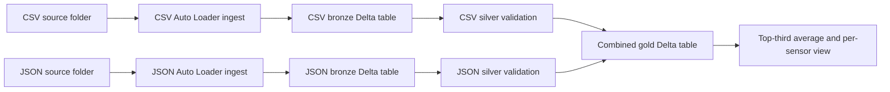

# Sensor Data Pipeline

## Purpose and Scope

Task : 
1. Ingest two source folders
2. combine the datasets
3. handle data-quality errors
4. present the average of the top one-third of sensor values. 
5. The extended requirement asks that the solution scale to a much larger dataset, potentially over 500 GB, when compute is scaled up.

## Technology Stack and Features

| Technology | Role |
| --- | --- |
| Databricks Jobs | Orchestrates the CSV, JSON, silver, and gold tasks with dependencies. |
| Python and PySpark | Implements Auto Loader ingestion and Spark DataFrame writes. |
| Spark SQL | Creates Delta tables, parses and validates sensor values, and computes the ranking and averages. |
| Auto Loader (`cloudFiles`) | Incrementally discovers CSV and JSON files and tracks progress with checkpoints. |
| Delta Lake | Stores bronze, silver, corrupted, and gold data with transactional table writes. |
| Unity Catalog Volumes | Supplies landing data and stores Auto Loader schemas and checkpoints. |

Implemented features include two-source ingestion, incremental file discovery, schema rescue, silver-layer type and date validation, a corrupted-row destination, a combined gold table, an overall top-third average, and a per-sensor top-third average view.

## Architecture

CSV and JSON ingestion run independently. Each silver task waits for its matching ingest task. Gold waits for both silver tasks, so it only combines the inputs after both branches complete successfully.

## Components

| Component | File | Responsibility |
| --- | --- | --- |
| Job orchestration | `pl_sensor_data.yml` | Defines the task graph, notebook paths, shared parameters, and job queue. |
| Bronze ingestion | `ingest_files.py` | Uses Auto Loader to discover source files, adds ingest metadata, and appends rows to Delta. |
| Silver processing | `clean_data.py` | Converts sensor fields to expected types and routes invalid rows to a corrupted-data table. |
| Gold processing | `gold_data.py` | Combines both silver tables and calculates top-third averages. |

## Job Configuration

The job resource is named `pl_sensor_data`. The four task keys are `csv_ingest`, `csv_silver`, `json_ingest`, and `json_silver`, followed by `gold_layer`.

The job-level key/value parameters are:

| Parameter | Default | Use |
| --- | --- | --- |
| `env` | `prod` | Selects the environment-specific schemas, volumes, and paths. |
| `schema_path` | `/Volumes/robocrit/robocrit_bronze_{env}/schemapaths` | Auto Loader schema tracking root. |
| `checkpoint_path` | `/Volumes/robocrit/robocrit_bronze_{env}/checkpoints` | Streaming checkpoint root. |
| `clear_data` | `"0"` | When set to `"1"`, silver and gold scripts drop their output tables before recreating them. |
| `file_type` | `"csv" or "json"`| Based on the source files |
| `file_path` | `/Volumes/robocrit/robocrit_ingest_{env}/landing` | Source Files Appear in this folder's subfolders | 

## Data Flow

### 1. Bronze Ingestion

`ingest_files.py` is run once for CSV and once for JSON. It reads the job parameters, creates the bronze schema and Unity Catalog volumes, then starts an Auto Loader stream using the configured source path.

The stream uses:

- `cloudFiles.format` set to the task's `file_type`.
- A schema location specific to the source table.
- Rescue mode with `_rescued_data` to retain data that does not fit the inferred schema.
- A maximum of 1,000 files and a soft target of 50 GB per micro-batch.
- `availableNow=True`, which processes the files available at stream start across micro-batches, then stops. Files arriving after startup are picked up on a later run.

For each micro-batch, the `foreachBatch` function adds:

| Column | Current derivation |
| --- | --- |
| `yyyymmdd` | Parent directory name extracted from `_metadata.file_path`. This is the source-folder date, not necessarily the event date. |
| `load_date` | Current processing timestamp. |
| `batch_id` | `epoch_id + 1` for the Auto Loader query. |

Rows are appended to `robocrit.robocrit_bronze_{env}.csv_sensor_data` or `json_sensor_data`, partitioned by `yyyymmdd` and `batch_id`. `batch_id` is being used as a partition column as source date folders might contain sensor data of multiple dates.

The checkpoint is source-specific (`{checkpoint_path}/{target_table}`) and is required to track discovered files and streaming progress.

### 2. Silver Validation

`clean_data.py` runs once per bronze table. It creates the silver schema and two Delta tables:

- `robocrit.robocrit_silver_{env}.{table}` for valid rows.
- `robocrit.robocrit_silver_{env}.{table}_corrupted` for rows that fail validation.

The valid table converts `event_date` using several timestamp formats, casts `sensor_number` to integer, and casts `sensor_value` to `DECIMAL(20,16)`. It excludes records with invalid converted fields, a non-null `_rescued_data`, or an invalid source-folder date.

Rows with failed field conversions, rescued data, or an invalid source-folder date are inserted into the corrupted table. The table retains the original sensor fields and metadata, the `_rescued_data` payload, and a semicolon-separated `corruption_reason` value. Reason codes include `invalid_event_date`, `invalid_sensor_number`, `invalid_sensor_value`, `schema_rescue`, and `invalid_source_folder_date`; a row can have more than one reason. The script adds the two quarantine columns to an existing table when they are missing, preserving prior quarantined rows; those older rows have null values for the newly added columns.

Both silver tables are partitioned by `yyyymmdd` and `batch_id`. Incremental selection compares numeric casts of `batch_id` to the maximum batch ID in the destination table. Valid and corrupted rows use separate destination watermarks.

### 3. Gold Combination and Aggregation

`gold_data.py` creates `robocrit.robocrit_gold_{env}.combined_sensor_data` and inserts rows from the CSV and JSON silver tables. It adds `source_table` (`csv` or `json`) and uses a per-source maximum `batch_id` to select newer rows.

The gold table is partitioned by `yyyymmdd`, `batch_id`, and `source_table`.

The script ranks values in descending order within each `sensor_number` using `PERCENT_RANK()`, retains rows where the rank is at most one-third, and displays the average of those readings. It also creates the `avg_top_sensor_value_vw` view with a separate top-third average for each sensor.

The overall average is displayed by the notebook and is not currently written to a persistent result table. 

## Tables and Outputs

For environment value `prod`, the principal objects are:

| Layer | Objects |
| --- | --- |
| Bronze | `robocrit.robocrit_bronze_prod.csv_sensor_data`, `robocrit.robocrit_bronze_prod.json_sensor_data` |
| Silver | `robocrit.robocrit_silver_prod.csv_sensor_data`, `csv_sensor_data_corrupted`, `json_sensor_data`, `json_sensor_data_corrupted` |
| Gold | `robocrit.robocrit_gold_prod.combined_sensor_data` |
| Gold view | `robocrit.robocrit_gold_prod.avg_top_sensor_value_vw` |

The gold table is the combined dataset. The view returns one top-third average per sensor. The notebook separately displays the overall average across all selected top-third readings.
